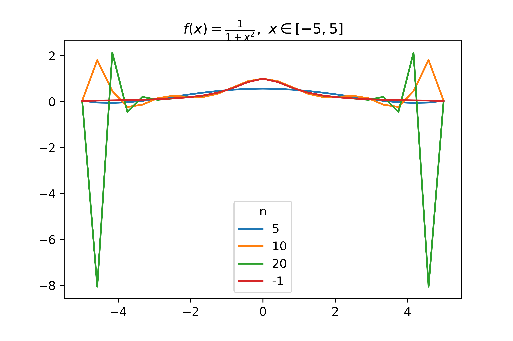

# 拉格朗日(Lagrange)插值

## 问题分析

### 实验要求

编写代码实现拉格朗日插值法的算法，用计算机计算拉格朗日插值函数（值）。

### 算法背景

拉格朗日插值法为较为经典的多项式插值法。多项式插值为估计原函数的方法。在生产时间和科学研究的实验中，函数经常无法直接写出表达式，只能采用函数表等形式。我们需要求得表中未列出的函数值时就需要做数值逼近，这样的数值逼近问题被称为插值逼近问题，此时就需要用到多项式插值。

### 算法特点

在高次多项式插值中，得到的插值函数虽然光滑，但随着次数增多一般并不具有收敛性，而且会产生 Runge 现象。

### 待求解问题

对 $f(x),~x\in \mathbf{A}$ 使用等距节点的拉格朗日插值法, 利用拉格朗日插值多项式 $P_n(x)$ 作为 $f(x)$ 的近似值, $n$ 为阶数, 亦即等距区间数, 求解不同的 $n$ 值下拉格朗日多项式的几处函数值. 

## 数学原理

给定平面上 $n+1$ 个不同的数据点 $(x_k, f(x_k)), k=0,1,\cdots,n, x_i \neq x_j, i \neq j$ 则满足条件
$$
P_n(x_k) = f(x_k), k = 0, 1, \cdots, n
$$
的 $n$ 次拉格朗日插值多项式
$$
P_n(x) = \displaystyle\Sigma^n_{k=0}f(x_k)l_k(x)
$$
是存在唯一的。若 $x_k\in[a, b], k = 0, 1, \cdots, n$，且函数 $f(x)$ 充分光滑, 则当$x\in[a,b]$时，有误差估计式
$$
f(x) - P_n(x) = \frac{f^{n+1}(\xi)}{(n+1)!}(x-x_0)(x-x_1)\cdots(x-x_n), \xi \in[a,b]
$$

## 程序设计流程

程序中包含了绘图的过程，由于在绘图过程中设计较多的取样以及计算，耗时可能较长。

核心代码：

```python
def Lagrangefunc(blist:list[list[float]]) ->tuple[ufunc,Add]:
    """
    Arguments:
        blist {list[list[float]]} -- 传入的点集合形如 [[1,2],[3,4]]
    Returns:
        tuple[ufunc,Add] -- (lambda,epr):lambda 插值函数的lambda形式，为Callable，epr 为 sympy 表达式，方便打印
    """
    n = len(blist)
    sym_x = sympy.symbols("x")
    L = 0
    for k in range(n):
        l = 1
        for j in range(n):
            if j == k:
                continue
            l = l*(sym_x-blist[j][0])/(blist[k][0]-blist[j][0])
        L = L + l*blist[k][1]
    return (sympy.lambdify(sym_x,L,'math'),L)

def Lagrange(blist:list[list[list[float]]],x:float) -> list[float]:
    """
    Arguments:
        blist {list[list[list[float]]]} -- 传入的点集合形如 [[1,2],[3,4]]
        xlist {list[float]} -- 传入的 x 表，为要计算插值函数值的点
    Returns:
        list[list[float]] -- 计算的插值函数点
    """
    func,_ = Lagrangefunc(blist)
    return (x,func(x))
```


## 实验结果、结论与讨论

### 问题 1

拉格朗日插值多项式的次数 $n$ 越大越好吗？

#### （1）

设 $f(x)=\frac{1}{1+x^2},~x\in[-5,5]$, 考虑等距节点的拉格朗日插值多项式 $P_n(x)$, 即将区间 $[-5,5]$ 进行 $n$ 等分, 构造 $P_n(x)$, 利用拉格朗日插值多项式 $P_n(x)$ 作为 $f(x)$ 的近似值. 分别取 $n=5,10,20$, 同时计算 $P_n(x)$ 在 $x=0.75,1.75,2.75,3.75,4.75$ 处的函数值. 

|  x\N |         5 |        10 |         20 | True value |
| ---: | --------: | --------: | ---------: | ---------: |
| 0.75 |  0.528974 |  0.678990 |   0.636755 |   0.640000 |
| 1.75 |  0.373325 |  0.190580 |   0.238446 |   0.246154 |
| 2.75 |  0.153733 |  0.215592 |   0.080660 |   0.116788 |
| 3.75 | -0.025954 | -0.231462 |  -0.447052 |   0.066390 |
| 4.75 | -0.015738 |  1.923631 | -39.952449 |   0.042440 |

由插值函数作图得：


可见当多项式的次数 $n$ 增大，在中心区域的拟合精度有所提升，但在区间的两端出现较大误差，即 Runge 现象。

#### （2）

设 $f(x)=e^{x},~x\in[-1,1]$, 考虑等距节点的拉格朗日插值多项式 $P_n(x)$, 即将区间 $[-1,1]$ 进行 $n$ 等分, 构造 $P_n(x)$, 利用拉格朗日插值多项式 $P_n(x)$ 作为 $f(x)$ 的近似值. 分别取 $n=5,10,20$, 同时计算 $P_n(x)$ 在 $x=-0.95,-0.05,0.05,0.95$ 处的函数值. 

|   x\N |        5 |       10 |       20 | True value |
| ----: | -------: | -------: | -------: | ---------: |
| -0.95 | 0.386798 | 0.386741 | 0.386741 |   0.386741 |
| -0.05 | 0.951248 | 0.951229 | 0.951229 |   0.951229 |
|  0.05 | 1.051290 | 1.051271 | 1.051271 |   1.051271 |
|  0.95 | 2.585785 | 2.585710 | 2.585710 |   2.585710 |

由插值函数作图得：


曲线几乎重叠，无法区分，于是做下面三图：


由两张 $(\hat{y}-y)$ 图（拟合值与真值之差）可见可见当多项式的次数 $n$ 增大，拟合精度提升。

#### 结论

拉格朗日插值多项式的次数 $n$ 并非越大越好。在某些情况确实是 $n$ 越大拟合精度越高，但在一般情况下 $n$ 增加反而会导致 Rouge 现象。但在实验中我们会发现两个现象：

1. 在靠近拟合区间的中心处，随着 $n$ 的增加，拟合精度会有提升。
2. 在实验所涉及的范围内，随着 $n$ 的增加，在 $y=e^x$ 下拉格朗日插值多项式出现了收敛的现象。

### 问题 2

插值区间越小越好吗？

#### （1）

设 $f(x)=\frac{1}{1+x^2},~x\in[-1,1]$, 考虑等距节点的拉格朗日插值多项式 $P_n(x)$, 即将区间 $[-1,1]$ 进行 $n$ 等分, 构造 $P_n(x)$, 利用拉格朗日插值多项式 $P_n(x)$ 作为 $f(x)$ 的近似值. 分别取 $n=5,10,20$, 同时计算 $P_n(x)$ 在 $x=-0.95,-0.05,0.05,0.95$ 处的函数值. 

|   x\N |        5 |       10 |       20 | True value |
| ----: | -------: | -------: | -------: | ---------: |
| -0.95 | 0.517147 | 0.526408 | 0.525620 |   0.525624 |
| -0.05 | 0.992791 | 0.997507 | 0.997506 |   0.997506 |
|  0.05 | 0.992791 | 0.997507 | 0.997506 |   0.997506 |
|  0.95 | 0.517147 | 0.526408 | 0.525620 |   0.525624 |

对插值区间 $[-1,1],[-5,5]$ 分别作图得：


可见当插值区间缩小时，对于两个区间的交集下的拟合精度提高。

#### （2）

设 $f(x)=e^{x},~x\in[-5,5]$, 考虑等距节点的拉格朗日插值多项式 $P_n(x)$, 即将区间 $[-5,5]$ 进行 $n$ 等分, 构造 $P_n(x)$, 利用拉格朗日插值多项式 $P_n(x)$ 作为 $f(x)$ 的近似值. 分别取 $n=5,10,20$, 同时计算 $P_n(x)$ 在 $x=-4.75,-0.25,0.25,4.75$ 处的函数值. 

|   x\N |         5 |         10 |            20 | True value |
| ----: | --------: | ---------: | ------------: | ---------: |
| -4.75 | -8.946983 |   0.463755 | 524288.000000 |   0.008652 |
| -0.25 |  0.778792 |   0.778801 |      0.778801 |   0.778801 |
|  0.25 |  1.284016 |   1.284025 |      1.284025 |   1.284025 |
|  4.75 | 77.924295 | 114.555505 | 360448.000000 | 115.584285 |

对插值区间 $[-1,1],[-5,5]$ 分别作图得：


几乎没有区别。

#### 结论

插值区间并非越小越好，需结合具体情况判断。

### 思考题

**（1）** 对实验 1 存在的问题，应如何解决？

插值次数并非高越好。实验 1 的第一例中对于高次插值出现了 Runge 现象，可通过适当降低次数，减小区间减轻此现象的影响。在次数的恰当选取上确实存在较大困难，由此我们可以转变思路，对函数进行分段低次插值，这样亦可起到降低次数，减小区间的效果。

**（2）** 对实验 2 存在的问题的回答，试加以说明

插值区间并非越小越好。虽然在提升精度上有一定的帮助，但在计算中可能并不会带来精度的大幅提升，参考实验 2 的第二例。且在实际应用中，我们需要数值逼近的函数值并不会由于我们需要提升精度而分布在更小的范围，另一方面函数表给出的值有限，缩小插值区间可能出现区间的插值点不够的情况，可能需要增加取样点，这样会带来额外开销。

**（4）** 如何理解插值问题中的内插和外推？

内插即在现有观测值之间进行估计，外推即在现有观测值之外进行估计。

一般来说对于连续函数内插的可靠程度高于外推，由于对于未知的连续函数而言，我们并无法得知在已知点之外其它函数信息，内推由于在估计点的附近有较多已知点，我们可以在一定程度上预测该点的大致位置。而对于外推来说我们对已知点分布的区域之外的信息并不了解，通过简单的多项式插值并不能对其进行精确估计。在外推上较为可靠的应该是回归拟合。
